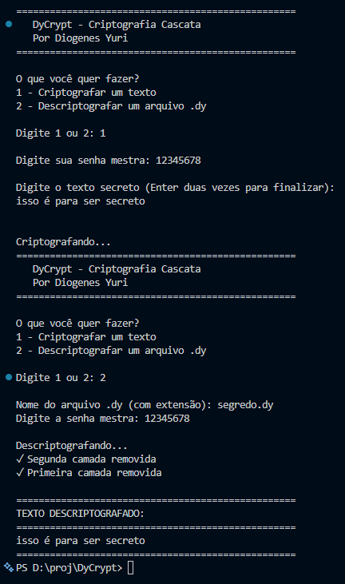

# 🔐 DyCrypt
**Por Diogenes Yuri**

Biblioteca Node.js que protege seus dados com **dupla camada de criptografia**. Seus dados passam por dois algoritmos diferentes (AES-256-GCM + ChaCha20-Poly1305), garantindo segurança máxima.

## 🎯 O que é Criptografia em Cascata?

É como trancar seus dados com **duas fechaduras diferentes**. Se alguém conseguir abrir uma, ainda tem a outra protegendo.

**Por que isso é mais seguro?**
- 🛡️ Se um algoritmo for quebrado no futuro, o outro ainda protege
- 💪 Atacante precisa quebrar DUAS criptografias diferentes
- 🎭 Cada camada usa técnicas diferentes, dificultando ataques

## ✨ Características

### Algoritmos de Criptografia

**Camada 1: AES-256-GCM**
- ✅ Padrão NIST, amplamente auditado
- ⚡ Suporte de hardware (AES-NI)
- 🔒 AEAD (Authenticated Encryption with Associated Data)

**Camada 2: ChaCha20-Poly1305**
- ✅ Design moderno por Daniel J. Bernstein
- 🛡️ Resistente a timing attacks
- 🚀 Padrão do TLS 1.3 e WireGuard

### Derivação de Chaves

- **Função:** `scrypt` (memory-hard KDF)
- **Vantagem:** Proteção contra ataques de GPU/ASIC
- **Salts:** Únicos por camada para máxima independência

### Formato Binário Customizado (.dy)

Todos os metadados ficam em **um único arquivo** - sem risco de perder informações!

```
[  0-15 bytes] Salt 1 - Camada AES (128 bits)
[ 16-31 bytes] Salt 2 - Camada ChaCha20 (128 bits)
[ 32-43 bytes] IV Camada 1 (96 bits)
[ 44-55 bytes] IV Camada 2 (96 bits)
[ 56-71 bytes] Auth Tag 1 (128 bits)
[ 72-87 bytes] Auth Tag 2 (128 bits)
[88-N  bytes] Seus dados criptografados
```

**Header:** 88 bytes | **Seus dados:** tamanho variável

## 📦 Instalação

```bash
# Clonar repositório
git clone <seu-repo>
cd DyCrypt

# Instalar dependências
npm install

# Compilar TypeScript
npm run build
```

## 🚀 Uso Rápido

### Criptografia Básica

```typescript
import { DyCrypt } from 'dycrypt';

// Criar instância com senha mestra
const dycrypt = new DyCrypt('SuaSenhaForte123!');

// Criptografar
const encrypted = await dycrypt.encrypt('Dados sensíveis');
console.log(encrypted);
// {
//   salt1: 'base64...',
//   salt2: 'base64...',
//   iv1: 'base64...',
//   iv2: 'base64...',
//   authTag1: 'base64...',
//   authTag2: 'base64...',
//   ciphertext: 'base64...'
// }

// Descriptografar
const decrypted = await dycrypt.decrypt(encrypted);
console.log(decrypted); // 'Dados sensíveis'
```

### Salvar em Arquivo Binário

```typescript
import { DyCrypt, packData, unpackData } from 'dycrypt';
import { writeFileSync, readFileSync } from 'node:fs';

const dycrypt = new DyCrypt('SuaSenha');

// Criptografar
const encrypted = await dycrypt.encrypt('Dados confidenciais');

// Empacotar TUDO em formato binário (arquivo único!)
const packed = packData(
  Buffer.from(encrypted.salt1, 'base64'),
  Buffer.from(encrypted.salt2, 'base64'),
  Buffer.from(encrypted.iv1, 'base64'),
  Buffer.from(encrypted.iv2, 'base64'),
  Buffer.from(encrypted.authTag1, 'base64'),
  Buffer.from(encrypted.authTag2, 'base64'),
  Buffer.from(encrypted.ciphertext, 'base64')
);

// Salvar (um único arquivo!)
writeFileSync('meus-segredos.dy', packed);

// Carregar
const loaded = readFileSync('meus-segredos.dy');
const unpacked = unpackData(loaded);

// Descriptografar (tudo vem do arquivo!)
const reconstructed = {
  salt1: unpacked.salt1.toString('base64'),
  salt2: unpacked.salt2.toString('base64'),
  iv1: unpacked.iv1.toString('base64'),
  iv2: unpacked.iv2.toString('base64'),
  authTag1: unpacked.authTag1.toString('base64'),
  authTag2: unpacked.authTag2.toString('base64'),
  ciphertext: unpacked.encryptedData.toString('base64')
};

const decrypted = await dycrypt.decrypt(reconstructed);
```

## 🧪 Executar Exemplos

### Exemplo Automático (Demo)
```bash
npm run build
npm run example
```
Cria um arquivo `dados-criptografados.dy` e demonstra o ciclo completo.

### Exemplo Interativo
```bash
npm run build
npm run interativo
```
Menu interativo onde você pode:
- ✍️ Criptografar textos que você digitar
- 🔓 Descriptografar arquivos `.dy` existentes

## 🏗️ Estrutura do Projeto

```
DyCrypt/
├── src/
│   ├── DyCrypt.ts           # Classe principal com criptografia cascata
│   ├── types.ts             # Tipos TypeScript
│   ├── index.ts             # Exports públicos
│   └── utils/
│       ├── packData.ts      # Empacota tudo em .dy
│       └── unpackData.ts    # Extrai dados do .dy
├── examples/
│   ├── demo.js              # Exemplo automático
│   ├── demo.ts              # Versão TypeScript
│   └── exemplo-interativo.js # Menu interativo
├── Doc/
│   └── image.png            # Banner do projeto
├── package.json
└── tsconfig.json
```

## 🔒 Segurança

### Por que scrypt?

`scrypt` é **memory-hard**, tornando ataques de força bruta com GPUs/ASICs extremamente caros. `pbkdf2` é apenas CPU-hard e pode ser acelerado com hardware especializado.

### Por que GCM e Poly1305?

Ambos fornecem **AEAD** (Authenticated Encryption with Associated Data):
- ✅ Confidencialidade (encryption)
- ✅ Integridade (auth tag)
- ✅ Autenticidade (detecta modificações)

### Salts e IVs

- **Salts:** Únicos por camada, garantem chaves independentes
- **IVs:** Gerados aleatoriamente (não precisam ser secretos)
- **Auth Tags:** Validam integridade criptográfica

## 📝 API

### `class DyCrypt`

#### `constructor(masterPassword: string)`
Cria uma instância com a senha mestra.

#### `async encrypt(data: string): Promise<EncryptedData>`
Criptografa dados usando cascata AES-256-GCM → ChaCha20-Poly1305.

#### `async decrypt(encryptedData: EncryptedData): Promise<string>`
Descriptografa dados, validando auth tags de ambas as camadas.

### Funções Auxiliares

#### `packData(salt1, salt2, iv1, iv2, authTag1, authTag2, encryptedData): Buffer`
Empacota todos os componentes em um único arquivo binário `.dy`.
- **Parâmetros:** 7 Buffers (2 salts, 2 IVs, 2 auth tags, ciphertext)
- **Retorna:** Buffer de 88 bytes (header) + tamanho dos dados

#### `unpackData(buffer): UnpackedData`
Extrai todos os componentes de um arquivo `.dy`.
- **Parâmetro:** Buffer do arquivo
- **Retorna:** Objeto com salt1, salt2, iv1, iv2, authTag1, authTag2, encryptedData

## ⚠️ Avisos Importantes

1. **Guarde sua senha:** Sem a senha mestra, **não há como recuperar** os dados. Anote em local seguro!

2. **Arquivo único:** Todo o necessário está no arquivo `.dy`. Não perca ele!

3. **Requisitos:** Node.js ≥ 18.0.0 (precisa de suporte nativo a ChaCha20-Poly1305)

4. **Uso em produção:** Para aplicações críticas, considere usar um KMS (Key Management System) para gerenciar a senha mestra

## 📜 Licença

MIT

## 🤝 Contribuindo

Contribuições são bem-vindas! Por favor, abra uma issue ou PR.

---

**Sim essa documentação foi gerada por AI e uma ajuda no codigo tbm, não devemos ter medo das maquinas e sim aprender a como opera-las a nosso favor**
